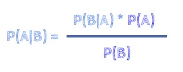
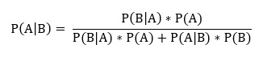
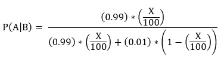

# Bayes Theorem

* @file     : Bayes_Theorem.ipynb
* @author   : Sinan KAMILCELEBI
* @version  : V1.0.1
* @date     : 11-April-2019
* @brief    : Thomas Bayes Theorem Example.

## __Örnek Soru:__   
Bir mühendis geliştirdiği bir sistem ile ürünleri test etmektedir. Bu sistem %99 oranında başarı ile bozuk ürünleri belirlemektedir. Bununla birlikte yapılan test işlemi %1 ihtimalle sağlam olan ürüne de bozuk demektedir. Tüm ürünlerin %X'i bozuk ise test sonucunda bozuk çıkan bir ürünün gerçekten bozuk olma olasılığı nedir? 

## __Çözüm:__  
<b>A</b> = Test edilen ürünün bozuk olma olasılığı.  
<b>B</b> = Sonucun pozitif (bozuk) olma olasılığı.  
<b>X</b> = Tüm ürünlerin bozuk yüzde değeri.

> Thomas Bayes teoreminin genel ifadesi:

## __Açıklamalar:__   
Yukarıdaki soruda bizden istenildiği üzere, sonucun bozuk olma olasılığı gerçekleştiğinde test edilen ürünün de bozuk olma olasılığını hesaplayacağız. <b>(P(A|B))</b>  

İlk önce yukarıdaki formülde belirtildiği gibi pay kısmında test edilen ürünün bozuk olma olasılığı gerçekleştiğinde sonucun bozuk olma olasığı <b>(0.99)</b> ile test edilen ürünün bozuk olma olasılığını <b>(X / 100)</b> çarpıyoruz <b>(P(B|A) * P(A)).</b> 

Daha sonra ise payda kısmında tüm durum için yani hem test edilen ürünün bozuk olma olasılığı gerçekleştiğinde sonucun bozuk olma olasılığını <b>(P(B|A) * P(A))</b> hem de test işleminin sonucu bozuk olduğunda test edilen ürünün bozuk olma olasılığını <b>(P(A|B) * P(B))</b> hesaplıyoruz.   

Son olarak da pay ve payda da elde ettiğimiz sonuçları birbirine oranladığımızda soruda bizden istenilen olasılık değerini elde etmiş oluyoruz. 
